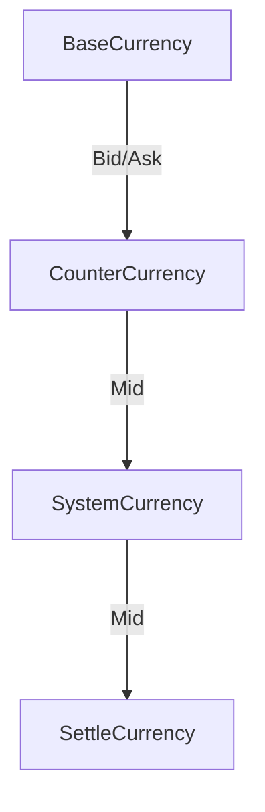
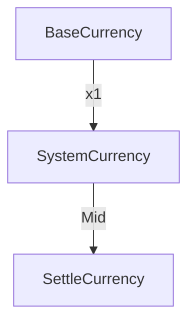
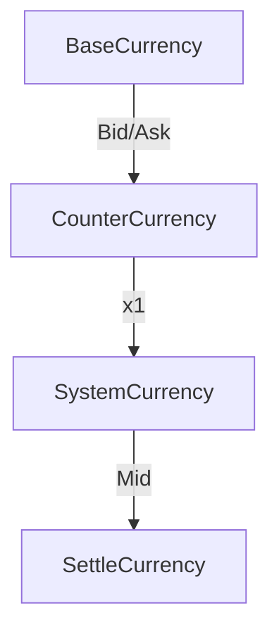

# Currency Overview

# Terminology

## Currency Pair

- Major
- Minor (cross 交叉盤)
- **Exotic**
- E.g.
    - EURUSD
    - USDJPY
    - EURAUD

## Base Currency

## Quote Currency (Counter Currency)

## Margin Currency

- The currency used for calculating margin

## Deposit Currency

- The currency of customer’s balance
- We use the name “settleCurr” in our Platform

## System Currency

- This term is only for our platform
- Usually USD, setup in ftsCompany
- Act as a bridge for comparison
- Convert different currency’s value into system currency first, otherwise it is impossible to compare them because they have different unit

## Direct Quote

- Whether System Currency is the base currency for that currency pair
- This is our own definition, don’t confused by standard definition
- E.g. USDJPY → YES
- EURUSD → NO

# Conversion Flow

- Let say we want to calculate the margin requirement

### If BaseCurrency ≠ SystemCurrency And CounterCurrency ≠ SystemCurrency


#### Example
- **Currency Pair**: EURAUD
- **System Currency**: USD
- **SettleCurrency**: HKD
- EURAUD Bid/Ask: 1.665/1.667
- AUDUSD Bid/Ask: 0.632/0.634
- USDHKD Bid/Ask: 7.77/7.79
```txt
100 Buy EUR -> HKD Path
BaseCurrency: 100 EUR
CounterCurrency: 100 x 1.667 [Ask] = 166.7 AUD
SystemCurrency: 166.7 x (0.632 + 0.634) / 2 [Mid] = 105.5211 USD
SettleCurrency: 105.5211 x (7.77 + 7.79) / 2 [Mid] = 820.954158 HKD

```

### If BaseCurrency == SystemCurrency



### If CounterCurrency == SystemCurrency



# Currency Entity

## Important Properties

```notion
- Currency Name
- EquivCurr
- Buy (Ask)
- Sell (Bid)
```

## Currency Name

- Base Currency + Quote Currency (Counter Currency)
- e.g. EURAUD

## EquivCurr

- The currency that link the base currency to System Currency (USD)
- E.g 1
    - Currency EURAUD
    - EquivCurr is EURUSD
- E.g 2
    - Currency AUDCAD
    - EquivCurr is AUDUSD

# Example

## 1. Calculate margin for buying 0.1 lot of EURJPY

- SystemCurrency: USD
- Ask: 163.108
- Counter Currency to System Currency:
    - USDJPY
    - DirectQuote: 1
    - Bid: 150
    - Ask: 151
- SettleCurrency: USD
- Margin Percentage: 1%

```
CounterCurrency to SystemCurrency Rate (CCR) = (150 + 151) / 2 = 150.5

SystemCurrency to SettleCurrency Rate (SettleRate) = (1 + 1) / 2 = 1

MarginRequirement
= Amount × Ask × 1 / CCR × SettleRate × MarginPercentage
= 10,000 × 163.108 × 1 / 150.5 × 1 × 1%
= 108.38 USD
```

- If DirectQuote is 0, multiply by CCR
- If DirectQuote is 1, divide by CCR
- EUR → JPY → USD → USD

## 2. Calculate margin for buying 0.2 lot of EURUSD

- SystemCurrency: USD
- Ask: 1.1050
- Counter Currency to System Currency:
    - N/A (SystemCurrency is USD)
- SettleCurrency: USD
- Margin Percentage: 1%

```
SystemCurrency Convert SettleCurrency Rate (SettleRate) = (1 + 1) / 2 = 1

MarginRequirement
= Amount x Ask x 1 / SettleRate x MarginPercentage
= 20 000 x 1.1050 x 1 / 1 x 1%
= 221 USD

```

- Since the CounterCurrency is already the SystemCurrency, no additional conversion is needed.
- EUR → USD → USD

# Follow up questions

- What if customer’s settlement currency is USD but he deposit HKD?